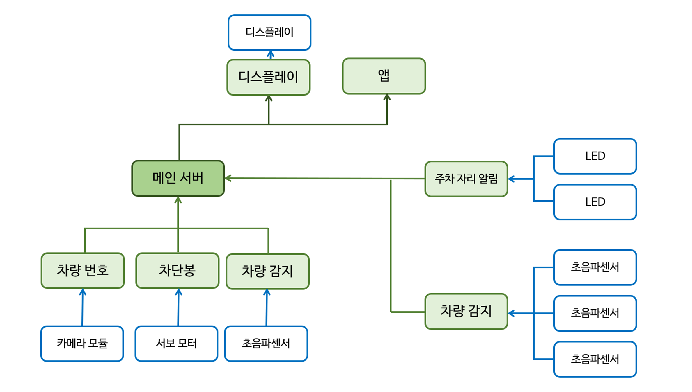

# Smart_Parking_System

## 임베디드 시스템 최종보고서'
**2조 : 배지호 박상원 김용빈 이재홍 **

---
## 목차 ##
1. 프로젝트 소개
2. 시스템 구조
3. 사용 센서 및 액추에이터
4. 기능 구현
5. 사용법
6. 한계

---
## 프로젝트 소개
### 주제
자동차를 주차만 할 수 있는 주차장이 아닌 여러가지 기능이 추가된 주차장이다.
추가되는 기능들은 다음과 같다.
- 출입차량 파악
- 주차 공간 현황 모니터링 및 LED표시
- 디스플레이와 앱에 실시간 출력
- 출차 주차시간 관리

기존에 있던 주차 관리 시스템과의 차별성을 두기 위해서 어플을 만들어 주차장이 아니더라도 주차장의 현재 상태를 확인할 수 있도록 하였다.

---
## 시스템 구조

시스템 구조는 다음과 같습니다.
- 메인 서버가 존재하고 모든 데이터를 보유 하고 있으며 필요에 따라 데이터를 송 수신함
- 초음파 센서를 통해서 차량 유무를 감지하고 LED 시각화 함. 그 후 데이터를 메인 서버로 전송
- 메인 서버로 부터 데이터를 받아 디스플레이 및 앱에 표시함
- 차량이 감지되면 사진을 촬영하고 번호를 인식하여 메인서버로 해당 데이터를 보냄.
- 서버에 해당 번호에 대한 정보 유무를 통해 입차인지 출차인지 구분함.
- 입차라면 입차 시간을 기록하고, 출차라면 주차시간을 계산해서 요금을 부과하고 차단봉을 여러서 통과시킴.

---
## 사용 센서 및 액추에이터
