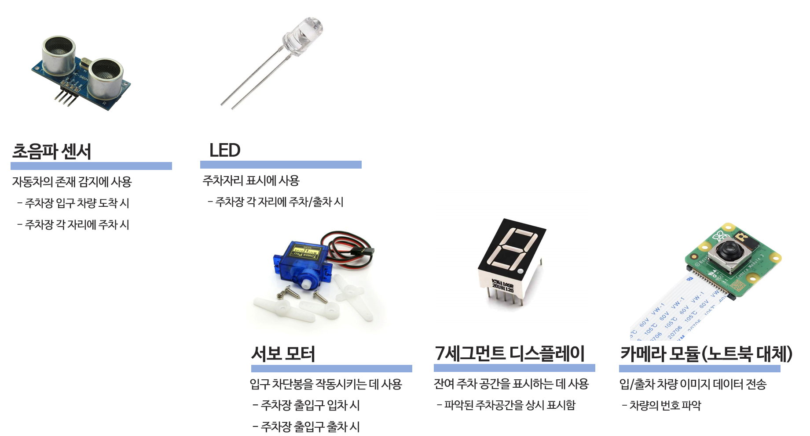

# Smart_Parking_System

## 임베디드 시스템 최종보고서
**2조 : 배지호 박상원 김용빈 이재홍**

---
## 목차 ##
1. 프로젝트 소개
2. 시스템 구조
3. 사용 센서 및 액추에이터
4. 기능 구현
5. 주요 함수
6. 사용법
7. 시현 동영상
8. 한계

---
## 1. 프로젝트 소개
### 주제
자동차를 주차만 할 수 있는 주차장이 아닌 여러가지 기능이 추가된 주차장이다.
추가되는 기능들은 다음과 같다.
- 출입차량 파악
- 주차 공간 현황 모니터링 및 LED표시
- 디스플레이와 앱에 실시간 출력
- 출차 주차시간 관리

기존에 있던 주차 관리 시스템과의 차별성을 두기 위해서 어플을 만들어 주차장이 아니더라도 주차장의 현재 상태를 확인할 수 있도록 하였다.

---
## 2. 시스템 구조

시스템 구조는 다음과 같습니다.
- 메인 서버가 존재하고 모든 데이터를 보유 하고 있으며 필요에 따라 데이터를 송 수신함
- 초음파 센서를 통해서 차량 유무를 감지하고 LED 시각화 함. 그 후 데이터를 메인 서버로 전송
- 메인 서버로 부터 데이터를 받아 디스플레이 및 앱에 표시함
- 차량이 감지되면 사진을 촬영하고 번호를 인식하여 메인서버로 해당 데이터를 보냄.
- 서버에 해당 번호에 대한 정보 유무를 통해 입차인지 출차인지 구분함.
- 입차라면 입차 시간을 기록하고, 출차라면 주차시간을 계산해서 요금을 부과하고 차단봉을 여러서 통과시킴.

---
## 3. 사용 센서 및 액추에이터

사용 센서 및 액추에이터는 다음과 같습니다.
- 초음파 센서를 이용해서 감지한 거리가 일정 거리 이하라면 차량이 존재한다고 인식함.
- 초음파 센서를 통해 차량 유무를 확인 한 뒤, LED로 시각화 함.
- 서브 모터를 이용해서 차단봉을 올리고 내리며, 출입 차량을 관리함.
- 7 세그먼트 디스플레이를 통해 1층 여분 자리, 2층 여분 자리, 총합 여분 자리를 보여줌.
- 카메라 모듈로 번호판을 찍어서 번호를 인식함 (추후 언급할 한계점으로 현재는 노트북 웹캠으로 대체)

---
## 4. 기능 구현
저희는 라즈베리 파이를 총 4대 사용하였습니다. 전압문제 및 과부하 방지를 위해서 최대한 라즈베리파이를 여러개 사용하려 노력하였습니다.
- 첫번째 라즈베리파이와 두번째 라즈베리파이는 초음파 센서를 2개씩 연결하여 차량 감지에 사용했습니다.
- 세번째 라즈베리파이는 메인서버역할과 출입차량 감지를 실행하였습니다. 출입차량 감지는 수동으로 진행되며 자동화시키지 못한점이 한계점으로 남아있습니다.
- 또한 세번째 라즈베리파이는 주차시간계산도 진행합니다. 시간측정은 C라이브러리인 <time.h>를 이용합니다.
- 메인서버와의 통신은 모두 와이파이 통신으로 이루어져있습니다. 소켓 통신으로 동작하며 클라이언트마다 그에 맞는 쓰레드 함수를 실행시켜 쓰레드를 적극적으로 사용하였습니다.
- 네번째 라즈베리파이는 7 세그먼트 디스플레이를 통한 주차 현황 출력에 사용하였습니다.

### 메인서버
- 기본적인 동작을 패킷을 받을 때 까지 대기. 전체 프로그램은 모두 와아파이 TCP 소켓 통신으로 구현.
- 연결이 완료 되고 Client에서 보내는 Class번호에 따라 알맞는 쓰레드 함수를 사용해서 쓰레드 생성 후 분리.
- 주차장 상태를 저장하는 parking[8]이 공유 변수이고 해당 변수에 접근하는 코드는 mutex로 보호

### 초음파 차량 유무
- 연결이 완료되면 Class 번호 1번을 서버에게 송신해서 자신의 역할(Detection)을 알림.
- 일정 거리보다 짧게 측정된다면 차량이 존재 (1), 길게 측정된다면 차량이 없음(0)
- 해당 위치 번호와 상태를 json데이터형으로 소켓 통신을 진행한다.
- 과부하를 막기 위해 1초에 한번씩만 측정 후 패킷을 메인서버로 송신

### 디스플레이 출력
- 연결이 완료되면 Class 번호 2번을 서버에게 송신해서 자신의 역할(Display)을 알림.
- 서버에서 현재 주차상태 데이터를 받아서 디스플레이에 반영.
- 디스플레이를 효율적으로 구동하기 위해서 멀티 플렉싱을 사용.
- 쓰레드를 이용하여 네트워크 데이터 수신과 디스플레이 갱신을 동시에 처리.

### 차량시간 계산
- 출입차량이 감지 되면 해당 자동차의 번호를 인식하여 메인서버로 전송.
- 만약 현재 주차된 차들 중 해당 번호가 존재한다면 출차하는 차량 -> 주차시간을 계산하여 요금 부과
- 만약 해당 번호가 존재하지 않는다면 입차하는 차량 -> 중앙서버에 번호 저장 및 입차 시간 기록
- 해당 동작이 끝나면 Class 5번에게 신호를 보내 차단봉 관리

### 차량 인식
- 입구에 일정 거리이하가 측정되면 차량이 존재한다고 판단 -> 사진촬영 (구현하지 못해 수동으로 변경)
- 일단은 기능 구현에 목표를 두고 번호를 최적화 함. (한 자릿수 번호판 사용, 숫자 크기 증가)
- 해당 차량의 번호를 추출하여 메인서버로 송신

### 주차자리 어플리케이션
- Flutter로 개발된 주차 관리 앱. 주차장의 층별 남은 공간을 사용자에게 표시
- JSON데이터를 송수신하여 주차 상태를 실시간으로 반영
- 주차 가능 여부와 서버 연결 상태를 색상(초록/빨강)으로 표시
- 서버 연결이 끊어질 경우, 새로고침 버튼으로 다시 연결
---

## 5. 주요 함수 
### 메인서버
- ```handle_client(차량 감지), handle_display(주차자리 여석 출력), handle_calc(주차 시간계산), handle_barrier(차단봉 관리), handle_signal(차량 진입 신호 관리)```와 같은 쓰레드 함수가 존재
- ```edit_parking_lot(int index, int state)``` : 주차 자리 데이터 갱신 함수
- ``` (else) if (class == number) ```를 통해서 쓰레드 생성 및 분리
### 초음파 차량 유무
- ```detection(int TRIG, int ECHO)``` : 초음파 감지 함수
### 디스플레이 출력
- ```setip()``` : 세그먼트 관련 변수(HIGH, LOW) 초기화
- ```displayNumber(int digit, int number)``` : 지정된 디스플레이에 특정 숫자 출력
- ```calculateRemaining(int *arr, int size, int *fitstFloor, int *secondFloor, int *total)``` : 배열 데이터를 기반으로 1층, 2층, 전체 남은 자리 수를 계산.
### 차량 인식
- ```predict_number(model, img)``` : 입력 이미지를 전처리하여 모델을 통해 숫자를 추출함.
- ```find_window(title)``` : 실행중인 Number.py창을 찾는 함수.
- ```send_key_to_window(hwnd, key)``` : 창 핸들을 활성화 한 후 입력한 key를 전송
### 주차자리 어플리케이션션
- ```_connectToServer()```: TCP 소켓 연결을 생성하고 JSON 데이터(배열)를 Map객체로 변환
- ```showDialog()``` : IP주소 수정기능 구현
- ```availableSpots()``` : Maps 객체를 통해 주차공간 확인 후 화면에 표시
- ```setstate()``` : 배열이 업데이트 될 때에 UI 자동 업데이트
- ```widget build()``` : 앱의 전체적인 UI 구성

## 6. 사용법

### 프로그램을 실행하기 전에
- 와이파이 통신을 진행하므로 모두 같은 와이파이에 연결되어 있어야 함.
- 해당 코드들의 처음부분에 상수 값으로 IP_SERVER을 하였음. 메인 서버의 IP로 수정할 것.
- 해당 코드들은 C언어와 파이썬으로 이루어져있음. C언어일 경우 컴파일 할때 -lcjson -lwiringPi 옵션을 추가할 것.
- wiringPi를 사용하기 위해서는 프로그램 실행 전 꼭 sudo 명령어를 추가할 것.

### 중앙서버 프로그램
- ```gcc -o server server.c -lcjson -lwiringPi -lpthread``` 로 컴파일 가능.
- 추가 옵션 없음 ```sudo ./server```로 실행 가능

### 초음파 차량 유무 프로그램
- ```gcc -o client client.c -lcjson -lwiringPi```로 컴파일 가능
- id(주차 자리), TRIG 핀 번호, ECHO 핀 번호, LED 핀 번호 순으로 옵션추가. 총 4개의 추가 옵션이 필수
- ex) ``` sudo ./client 1 15 25 18 ```
- 해당 터미널에서 현재 프로그램의 상태를 출력함

### 디스플레이 프로그램
- ```gcc -o display display.c -lcjson -lwiringPi -lpthread``` 로 컴파일 가능.
- 추가 옵션 없음 ```sudo ./display```로 실행 가능
- 디스플레이 연결 시 GPIO 핀 번호와 코드 내 핀 번호가 일치하도록 설정이 필요함.
- usleep 값 조정으로 디스플레이 갱신 속도 최적화 가능

### 차량 번호 인식 프로그램
- Number.py, inputKey.py 순으로 프로그램을 실행한다.
- inputKey.py를 통해 프로그램이 w키를 입력하도록 하면 Number.py가 사진을 촬영하여 번호를 추출한다.
- 해당 기능을 통해서만 아니라 w키를 직접 누름으로써도 사진 촬영이 가능하다.
- 사진을 촬영하는 기준은 차량 유무 감지인데 이는 다른 프로그램이 신호를 보내준다.
- 원래는 초음파를 이용해서 차량을 감지하지만 개발기간 부족으로 인해 수동으로 조절.
- 입력값을 0이하의 값으로 주면 차량 감지 및 촬영시작.
- 해당 작업은 중앙서버 라즈베리파이 터미널에서 진행

### 차단봉 관리 프로그램
- ```gcc barrier barrier.c -lwiringPi -lcjson```로 컴파일 가능.
- ```sudo ./barrier```로 실행 가능
- GPIO핀 18번을 통해 서브모터 제어.

### 주차자리 어플리케이션
- 같은 와이파이에 연결된 핸드폰만 이용하면 크게 문제가 없음.

**충돌을 방지하기 위해 다음과 같은 순서로 프로그램을 실행하여 주시기 바랍니다.**
- ```sudo ./server```
- ```python Number.py```
- ```python inputKey.py```
- ```sudo ./barrier```
- ```sudo ./client id TRIG ECHO LED_PIN``` (모두 켜기)
- ```sudo ./display```
- 핸드폰 어플리케이션 접속

## 7. 시현 동영상
[https://youtu.be/YR0sNVt3elI](https://youtu.be/YR0sNVt3elI)

## 8. 한계점
- 라즈베리파이의 성능으로 인해 주차장의 크기를 확장시킬 수 없었음.
- 라즈베리파이의 성능으로 인해 좀 더 고성능의 숫자인식 프로그램 적용이 어려워 간단한 숫자 인식으로 변경.
- 개발기간이 촉박하여 출입차량 초음파 감지를 구현하지 못함
- 라즈베리파이의 카메라 모듈의 성능이 매우 좋지 못하여 노트북 웹캠으로 카메라 모듈을 대체함
